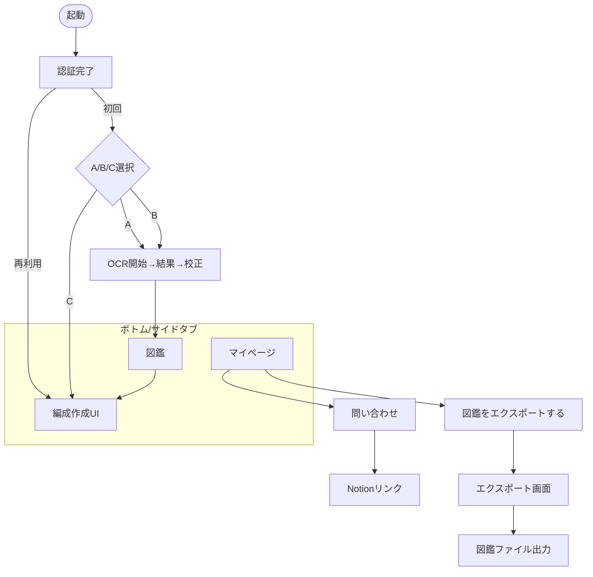

# 04\_User\_Flows.md — MVP
Last-Updated: 2025-09-25

---

## 1. 目的と適用範囲
MVP版「三国志真戦 編成アプリ」における\*\*ユーザーフロー（画面遷移と操作シナリオ）\*\*を定義し、UI（03）・要件（01）・用語（02）間の整合を取る。
- 対象プラットフォーム：Webアプリ（レスポンシブ）／将来PWA（01）
- 編成UIの基本方針：ジグソーパズル感／スマホ縦でタップ主導／共存性の自動検証はMVPでは非対応（03）
- 保存：ローカル自動保存（IndexedDB）＋サーバ保存（Firestore）（03）
- 共有：MVPはファイル渡し（画像/CSV）のみ（01）。URL共有は非スコープ。

---

## 2. 用語整合（02 に準拠）
- 武将 = `warlord`／戦法 = `skill`（指揮/アクティブ/突撃/パッシブ/兵種/陣法）／兵法書 = `tactics`
- 陣営（魏=gi／呉=go／蜀=shoku／群=gun）、兵種（騎兵/盾兵/弓兵/槍兵/兵器）、レア度（星3〜5。ただし焦点は主に星5）（02）
- 凸（`limit_break`）：1枚=無凸、5枚=4凸（02）
> 表記はUI/モデルともこの英語キーをベースとする（02）。
> 本ドキュメントの項目名・イベント名は、02_Dictionary_Master の英語キーに準拠。

---

## 3. 全体像（入口〜価値獲得）
目的（01）: ①編成作成支援／②資産管理（図鑑作成）／③編成依頼効率化（将来）。
### 3.1 初回体験の3導線（01 のA/B/C）
1. A: 「自分だけの武将図鑑を作成してみる」 … まずアップロード等で図鑑準備（資産登録中心）
2. B（おすすめ）: 「自分の手持ちを読み込ませて編成作成」 … OCRで所持を取り込み→編成へ
3. C: 「手持ちを読み込まずに編成作成」 … すぐ編成UIへ（のちほど資産読み込み可）
> KPI（01/3.2）: `signup_complete→choose_B→ocr_batch_start→ocr_batch_done→assets_confirmed` のp50≤180s / p95≤600s など。
> （計測）主要導線BのTTOCRバッチは 01 に定義のp50/p95目標に準拠。
---

## 4. フロー詳細
### 4.1 認証と初期動線
### 4.1.1 認証
1. 認証：Firebase Authentication、Google認証（MVP）。Apple / メールMagic Link（パスワードレス）は Phase 2 以降で再検討。
2. `signup_complete` を計測（01/3.2, 03/12.5）
3. A/B/C選択画面を表示（01）。`choose_A|choose_B|choose_C` を計測。
> アクセシビリティ（01/4.1, 03/13）：44px以上のタップ領域、キーボード操作（Tab, 矢印, Enter/Space）を全主要操作で許容。
> 認証でGitHubは不要

#### 4.1.2：初期動線
- フローA（OCR成功）：　図鑑作成（OCR）　→　図鑑閲覧→図鑑作成（手動）　→　図鑑閲覧
- フローA（OCR失敗）：　図鑑作成（OCR）失敗　→　エラーメッセージと共に、編成作成UIを試すか質問　→　所持トグル不使用設定で編成作成UI
- フローB（OCR成功）：　図鑑作成（OCR）　→　図鑑閲覧→図鑑作成（手動）　→　編成作成UI
- フローB（OCR失敗）：　図鑑作成（OCR）失敗　→　所持トグル不使用設定で編成作成UI
> フローBにて失敗時：所持トグル不使用設定で編成作成へ動線。初回遷移時だけ一時的に ownershipAware=false 

### 4.2 資産登録（図鑑作成）フロー（A/B）
#### 4.2.1：図鑑作成（OCRで一括登録）
1. OCRバッチ開始（`ocr_batch_start`）
   - 端末ギャラリー等からスクショ複数を選択（01）。
   - 画像要件が満たない場合はアップロード拒否（01のリスク対策）。
2. OCR処理→結果一覧表示（`ocr_batch_done`）
3. 校正フェーズ：誤認を手動修正→確定（`assets_confirmed`）。
4. 編成UIへ遷移。武将・戦法パレットは「所有物考慮/マスタ版」トグルに対応（兵法書は常にマスタ）。OCR確定後は 所有物考慮 に切り替える導線を提示。
5. 到達率/KPIの計測（01/3.2）。
> OCRで不明な武将は「未解決リスト」に入り、図鑑で手動対応する。（イベント ocr_unresolved_count）
> （プライバシー）OCR用のスクリーンショットは一時処理のみでサーバ保存しない（01）。必要時は匿名化＋短期保持。
> （アップロード制約：初期値）最大20枚／5MB/枚・合計80MB・最小1080×1920、JPEG/PNG/HEIC。
> （HEICはサーバ変換）、並列4、レート制御あり（01）。

#### 4.2.2：図鑑閲覧
- 目的：所持の可視化・更新（01）。
- 画面：図鑑。
- 常時表示のサイドバー：設定用ボタン（未所持/所持/1凸/2凸/3凸/4凸/5凸）
- 操作：ズーム/パンで閲覧。検索機能は無し。
- 出口：完了後、フローBの場合、編成作成UIへ動線。
- 図鑑と編成作成UIの関係：MVPでは、図鑑情報に基づき、未所持/所持をセル色などで判別可能な状態とする（フィルタ機能なし）。

#### 4.2.3：手動追加・編集
- 図鑑閲覧画面で個別の武将/戦法をタップすることで更新可能（所持/0-5凸）。
- 個別の武将/戦法エリアとは別に、サイドに（未所持/所持/0-5凸）等のボタンを備える。
- 個別の武将/戦法のタップするとアクティブとなり、サイドのボタンをタップすると更新反映。
- 更新後は、アクティブ解除
- 保存：入力ごとに即時ローカル自動保存。図鑑のサーバ自動保存は、MVPではナビゲーション境界のみ。
> 文字入力なしで、タップベースによる操作性重視

---

### 4.3 編成作成フロー（03 のUI準拠）
#### 4.3.1 構成（03/1.1-1.3）
- PC/タブレット横/スマホ横画面：左右分割（左=編成パレット、右=武将/戦法/兵法書パレット）。
- タブレット縦/スマホ縦：上下分割（上=編成パレット、下=武将/戦法/兵法書パレット）。
- ズーム/パン対応（ピンチ/ダブルタップ、2本指ドラッグ）。リセットあり（03）。
- PC/タブレットではD&Dは補助。タップ/クリック操作のみで全手順が完結（03）。
- 兵法書パレットは所有物の概念なし（常にマスタ）。

#### 4.3.2 操作
1. 「編成作成」開始（`composition_start`）。
2. 武将スロット（3枠）に warlord を割当。
3. 各武将に skill（指揮/アクティブ/突撃/パッシブ/兵種/陣法）と tactics（兵法書）を割当。
4. 状態はテキストUIで可視化（所持/未所持/凸/アクティブ枠の表現方針は03/6の案から選定）。
5. ローカル自動保存（デバウンス500ms）（03/11）。
6. 任意タイミングでサーバ保存→ID発行→マイ編成一覧に反映（`first_composition_save` ほか／03）。
- PCキーボード操作（03/13）：Tab/Shift+Tabで移動、矢印で隣接スロットへ、Enterでアクティブ化、Space/Enterで割当、Enter→矢印→Enterで入替。
- モバイル代替（01/4.1）：長押し→入替 or 入替モードでタップ選択。
> 注：共存性の自動検証はMVPで非搭載（03/5）。必要なら手動で視認／上級者運用。

### 4.4 図鑑エクスポート（MVPの共有手段）
1. マイページからエクスポート画面を開く
2. 画像エクスポート（`export_image`）
3. CSVエクスポート（`export_csv`）
4. 外部共有はファイル渡しを想定（01/5.1）。
> 【一般的推奨】ファイル名規約：`shinsen_zukan_<yyyymmdd>_<uid>_<hash>.png|csv`。競合防止と後方検索性のため。
> 外部共有はユーザーの手動スクショ用の画面表示とする選択肢あり。開発とユーザー操作の簡易化。
> 出力メタ：将来的に、composition_id／辞書バージョン／エクスポート時刻をメタとして埋め込む（品質・追跡性向上）。

### 4.5 エラーフロー / 例外系
- OCR失敗：再撮影ガイド→再実行。繰返し失敗時はOCRフローのスキップ（MVPでは、所持トグル無し不使用での編成UI移行誘導。将来的にはCSVインポート誘導）（01/6）。
- 画像品質不足：アップロード前にガード（01/6）。
- サーバ保存失敗：ローカル保持のままリトライ／回線復旧後自動送信（03/12.5 の送信指針）。【一般的推奨】トースト＋リトライCTA。
- オフライン：IndexedDBのみで編集継続→オンライン復帰時に保存案内。【一般的推奨】復帰検知でバナー表示。

### 4.6 マイページ
- 目的：MVPではミニマム。将来的に項目追加。
- 画面：マイページ（03のタブ構成に準拠）
- 操作：
  1. 図鑑のエクスポート
  2. 問い合わせ（外部「Notion」に用意した問い合わせフォームに遷移）

### 4.7 編成師フロー（相談を受ける側）
- 目的：仲間の資産情報を受け取り編成提案（01の③編成依頼効率化に該当）
- 入口：仲間からのエクスポート済み図鑑（CSVまたは画像）を受領
- 操作：
  1. 受領データを読み込み、資産管理画面に反映（インポート機能は将来。現状は受領画像を別途閲覧）
  2. 編成UIで提案編成を作成（フリー編成エリアで未所持トグルを使用）
  3. 出力（画像／CSV）で返却
- MVPでは直接リンク共有は非スコープ（01/5.1）。

---

## 5. 画面遷移サマリ（MVP）
| From       | Action             | To               | イベント                              |
|------------|--------------------|------------------|---------------------------------------|
| 起動       | 認証完了（初回）    | フロー選択画面     | `signup_complete`, `onboarding_open`  |
| 起動       | 認証完了（再利用）  | 編成作成UI         | `app_open_return`                     |
| フロー選択画面 | フローA選択          | OCR開始           | `choose_A`                            |
| フロー選択画面 | フローB選択          | OCR開始           | `choose_B`                            |
| フロー選択画面 | フローC選択          | 編成作成UI         | `choose_C`                            |
| OCR開始    | スクショのアップロード | OCR結果           | `ocr_batch_start`                     |
| OCR結果    | 校正→確定            | 図鑑             | `ocr_batch_done`, `assets_confirmed`  |
| 図鑑       | OCR実行             | OCR開始           | `ocr_batch_start`                     |
| 図鑑       | 編成作成へ           | 編成作成UI         | `composition_start`                   |
| マイページ   | 問い合わせ           | 外部「Notion」ページ | `support_open`                        |
| マイページ   | 図鑑をエクスポートする | エクスポート画面    | `export_menu_open`                    |
| エクスポート画面 | 形式選択→出力→保存   | マイページ         | —                                     |

> 注：編成パレットはマスタ全件（所有フィルタなし, 03/1.2）。

---

## 6. 計測ポイント（01/3.2, 03/12.5）
### 6.1 主要イベント
- `signup_complete` … 初回認証完了
- `choose_A|B|C` … フロー選択
- `ocr_batch_start` … OCR処理開始
- `ocr_batch_done`, `assets_confirmed` … OCR完了・図鑑確定
- `composition_start` … 編成作成開始
- `first_composition_save` … 初回編成保存
- `export_assets` … 図鑑エクスポート（マイページから）
- `settings_open` … 設定画面表示
- `support_open` … サポート（Notionリンク等）

### 6.2 補助イベント
- `ocr_correction_edit` … OCR校正時の修正回数
- `export_menu_open` … 図鑑エクスポート画面表示
- `save_retry` … サーバ保存リトライ回数
- `offline_resync` … オフライン復帰時の再送同期
- `composition_open` … 一覧から編成選択
- `assets_open` … マイページから図鑑画面遷移

### 6.3 指標例（01準拠）
- TTFL\_app = `app_landing→first_composition_save`（p50≤600s, p95≤1800s）
- TTC\_composition = `composition_start → first_composition_save`
- TTOCR\_batch = `signup_complete→choose_B→…→assets_confirmed`

### 6.4 送信方式（03/12.5）
- `navigator.sendBeacon` を基本とし、SWによる再送を併用。
- 失敗時はリトライ回数をカウント。

---

## 7. アクセシビリティ運用（01/4.1, 03/13）
### 7.1 基本要件
- コントラスト比 AA以上
- フォーカス可視化、aria属性付与
- タップ領域44px以上

### 7.2 操作代替
- D&D操作は補助とし、必ずクリック/タップで同等操作可能
- PC: Tab/矢印/Enter/Spaceで全操作可能
- スマホ: タップで選択（長押しは、将来的に武将等の詳細ポップアップ）

### 7.3 フォーカス順序
- 左→右／上→下
- スロット → パレット → サイド情報の順に循環
- 【一般的推奨】`skip to palette` ショートカットを設置

---

## 8. 付録：Mermaid簡易フロー
> 表示非対応環境ではテキスト参照。 スマホ縦=ボトムタブ、横=サイドタブ、PC=サイドバー（03\_UI\_Spec\_v2）。

---

## 9. 差分メモ
- 本ドラフトで追加した:
  - 補助イベント: `ocr_correction_edit`, `export_menu_open`, `save_retry`, `offline_resync`, `composition_open`, `assets_open`
  - フォーカスショートカット `skip to palette`
  - オフライン復帰時の再送処理カウント
- いずれも01/02/03に矛盾せず、未記載の運用補足として記述。
- 一部のイベント（例：`first_composition_save`）は、5章の画面遷移サマリには登場しないが、計測目的で6章に定義している。UI上の明示的な画面遷移を伴わないため。
- 今後Mermaid図で簡略化を行う場合は、差分メモにその旨を明記する運用とする。
